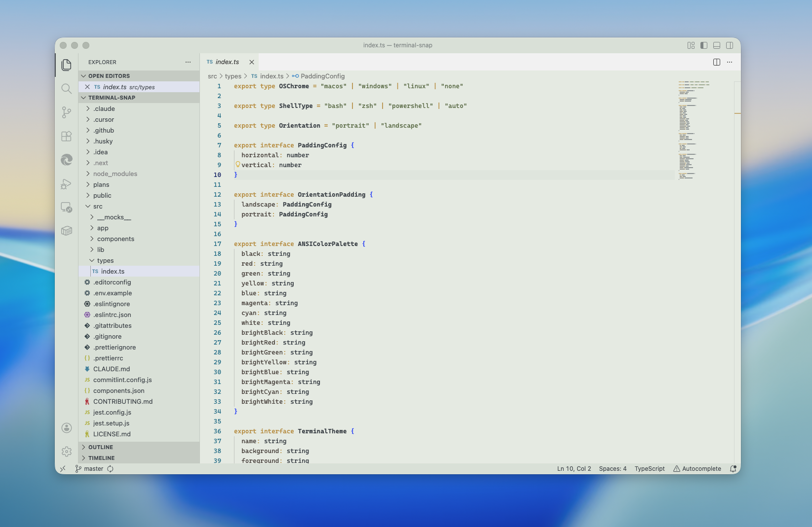
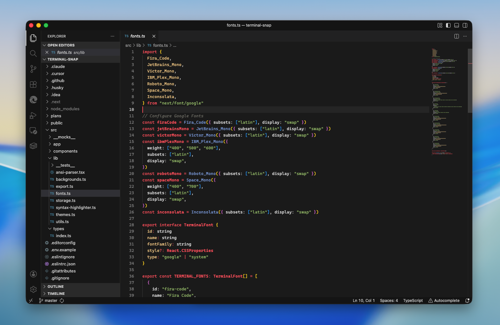

# Ukiyo-Tone (浮世トーン)

> *Ukiyo-Tone is a restrained, culturally grounded coding theme designed as a personal instrument — calm, sharp, and built for long hours of focused work.*

<p align="center">
  
</p>

**Ukiyo-Tone** is a visual instrument for thinking in code, inspired by 17th-century Japanese Ukiyo-e woodblock prints and Sumi-e ink traditions. It is not designed for novelty or mass appeal, but as a deliberately constrained environment that *disappears* once deep focus begins.

The goal is not excitement; the goal is **clarity with character**.

## The Theme Bundle

This extension includes six distinct themes, each inspired by specific elements of the Edo period aesthetic:

### 1. Asahi (旭 - Morning Sun)


**Light Theme.** Inspired by fresh Washi paper and early morning light.
*   *Core concept:* High readability, organic paper feel.

### 2. Karesansui (枯山水 - Dry Landscape)



**Zen Garden Theme.** Inspired by moss, stone, and raked sand.
*   *Core concept:* Muted moss tones with bamboo yellow accents for a peaceful focus.

### 3. Tasogare (黄昏 - Twilight)


**Soft Dark Theme.** Inspired by evening landscapes and faded indigo dyes.
*   *Core concept:* Low eye strain, muted atmospheric tones.

### 4. Koke-Dera (苔寺 - Moss Temple)


**Monotone Dark Theme.** Inspired by deep forest shadows and moss gardens.
*   *Core concept:* Deep forest green background with a loose monotone green palette for immersion.

### 5. Kuro-Sumi (黒墨 - Black Ink)



**Deep Dark Theme.** Inspired by charcoal ink drawings and midnight shadows.
*   *Core concept:* Dramatic contrast, vivid highlights.

### 6. Kachi-iro (勝ち色 - Victory Color)


**High Contrast Dark Theme.** Inspired by the "lucky" deepest navy indigo worn by Samurai.
*   *Core concept:* Accessibility and sharp focus.

## Core Philosophy

Ukiyo-Tone is built on four central pillars defined in our [Philosophy & Brand Identity](PHILOSOPHY.md):

*   **Restraint Over Abundance:** We reject excess. Every visual choice must justify itself through readability, hierarchy, or focus. No unnecessary colors or ornamental contrast.
*   **Structure Before Decoration:** Color is treated as **syntax**, not paint. Keywords define grammar, functions express motion, and variables carry weight.
*   **Organic, Not Mechanical:** Inspired by woodblock prints, slight softness is intentional. Visual breathing room is respected, ensuring the interface feels *worked by hand*.
*   **Long-Session Ergonomics:** Designed for endurance. If a choice improves a screenshot but harms long-term focus, it is rejected.

## Visual Translation

We use Japanese visual culture as a system of constraints to guide the developer experience:

*   **Sumi-e Syntax:** Comments are italicized to mimic hand-written calligraphy, while Classes and Constants are bolded to provide structural "outlines" similar to woodblock frame lines.
*   **Hanko Selection:** The selection color is inspired by the red ink of a *hanko* (artist's signature stamp), providing a clear but culturally grounded focal point.
*   **Calm, Sharp, Neutral:** The emotional tone is intentional—reducing fatigue and preserving precision without emotional noise or gimmicks.

## Installation

### From the Zed Extensions Marketplace

*Once published to the official Zed Extensions marketplace:*

1. Open Zed Editor
2. Press `Ctrl+Shift+X` (or `Cmd+Shift+X` on macOS) to open the Extensions panel
3. Search for `Ukiyo-Tone`
4. Click **Install**
5. Activate the theme using `Ctrl+K Ctrl+T` (or `Cmd+K Cmd+T` on macOS) to open the theme selector
6. Select your preferred Ukiyo-Tone variant from the list

### Manual Installation

For development, testing, or if installing from a local build:

#### Install as Theme Files (Simple Method)

**macOS / Linux:**
```bash
# Copy theme files to Zed's themes directory
cp editors/zed/themes/*.json ~/.config/zed/themes/
```

**Windows:**
```powershell
# Copy theme files to Zed's themes directory
copy editors\zed\themes\*.json %USERPROFILE%\AppData\Roaming\Zed\themes\
```

#### Install as Extension (Advanced Method)

If you have the full extension package:

**macOS:**
```bash
cp -r editors/zed ~/Library/Application\ Support/Zed/extensions/installed/ukiyo-tone
```

**Linux:**
```bash
cp -r editors/zed ~/.local/share/zed/extensions/installed/ukiyo-tone
# or if using XDG_DATA_HOME:
cp -r editors/zed $XDG_DATA_HOME/zed/extensions/installed/ukiyo-tone
```

**Windows:**
```powershell
xcopy /E /I editors\zed %LOCALAPPDATA%\Zed\extensions\installed\ukiyo-tone
```

After copying files, restart Zed or reload the theme selector to see your themes.

### Activating Themes

1. Open the command palette with `Ctrl+Shift+P` (or `Cmd+Shift+P` on macOS)
2. Type `theme selector: toggle` or use the shortcut `Ctrl+K Ctrl+T` (or `Cmd+K Cmd+T` on macOS)
3. Browse the available Ukiyo-Tone themes and preview them in real-time
4. Press `Enter` to apply your selection

## Recommended Settings
To fully embrace the *Ukiyo-Tone* philosophy of restraint and focus, we recommend the following editor settings to reduce visual noise:

```json
{
  "editor.renderLineHighlight": "gutter",
  "editor.occurrencesHighlight": false,
  "editor.minimap.enabled": false,
  "breadcrumbs.enabled": false,
  "editor.guides.indentation": false,
  "editor.guides.bracketPairs": "active"
}
```

## Fonts
This theme pairs exceptionally well with typefaces that balance geometric precision with organic curves.

*   **Primary Recommendation:** [Iosevka](https://typeof.net/Iosevka/) (Custom build or standard) — *Its slender, precise feel matches the "sharp" and "ink" aesthetic.*
*   **Alternative:** [JetBrains Mono](https://www.jetbrains.com/lp/mono/) — *Excellent for the "high readability" goal of the Asahi theme.*

## Authors
**Mohit Sharma** (@mohitSharma74)

## Tags
`vs-code-theme` `japan` `ukiyo-e` `minimal` `dark-theme` `light-theme` `focus`

## License

[MIT](LICENSE)